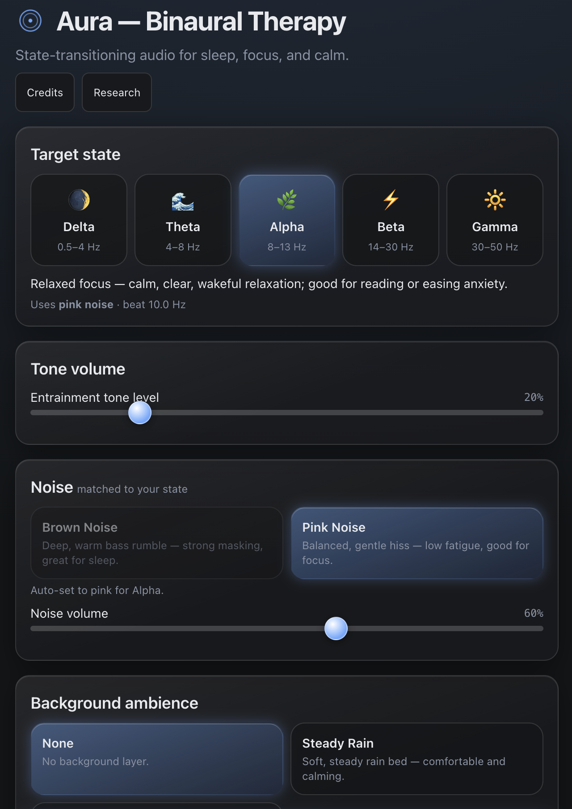
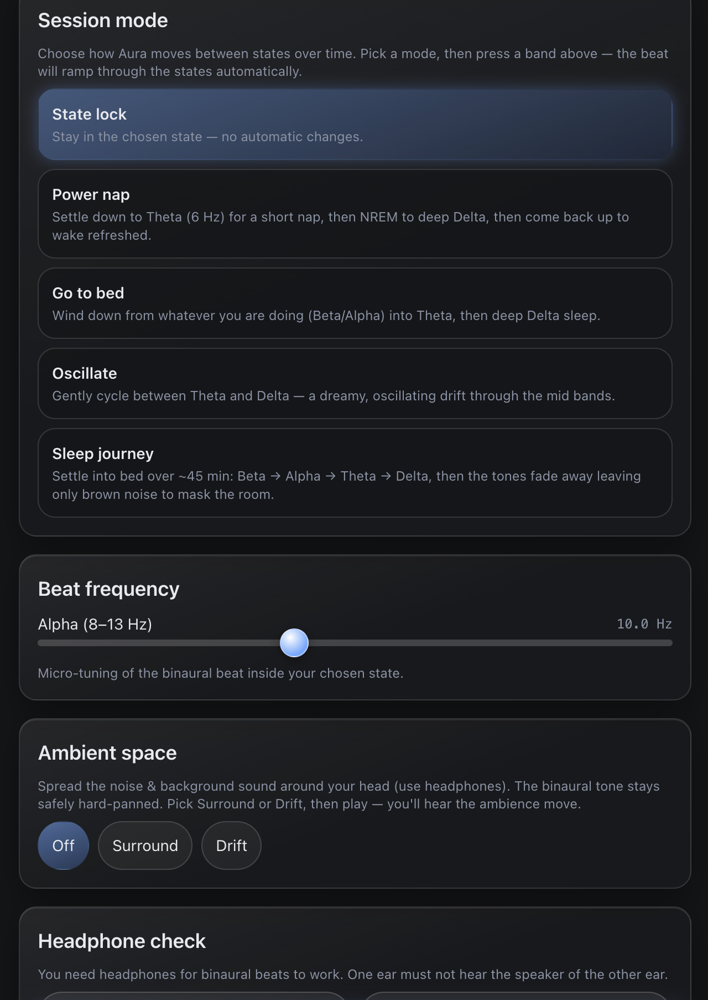
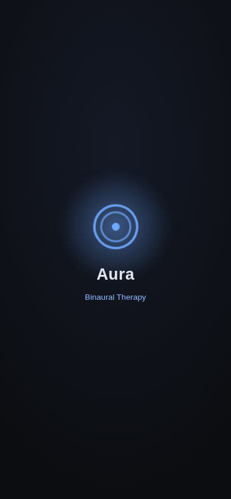

# Aura — Binaural Therapy

A state-transitioning binaural beats and colored noise web app, designed **iOS-first** as an installable PWA. Use it for sleep, focus, and relaxation.

**Live:** [aura.sharefront.net](https://aura.sharefront.net)

<table>
  <tr>
    <td align="center"><br><em>Dark (default)</em></td>
    <td align="center"><br><em>White theme</em></td>
    <td align="center"><br><em>Startup splash</em></td>
  </tr>
</table>

---

## Features

- **Binaural beat sessions** across the brainwave bands — Delta, Theta, Alpha, Beta, Gamma.
- **Session modes** that transition state over time:
  - **State lock** — hold a fixed band
  - **Power nap** — short focused reset
  - **Go to bed** — wind down with a falling band
  - **Oscillate** — drift between two bands
  - **Sleep journey** — a 45-minute ramp with a 180s tone fade
- **Colored noise** layer (Brown, Pink) plus **ambient backgrounds** (Rain, Ocean, None), each with independent gain.
- **Themes** — Dark (default), White, and Sepia for pre-sleep eyes, rendered in a frosted liquid-glass style with iOS-look buttons and sliders.
- **Shareable presets** — share a link that recreates your exact band, noise, background, beat and mode.
- **Offline-ready PWA** — install to your Home Screen, works with a service worker.
- **Ambient-space HRTF** (optional) — spatializes the noise/background layers for a 3D soundscape.

## Install

Open [aura.sharefront.net](https://aura.sharefront.net) in Safari (iOS) or Chrome (Android/desktop) and choose **Add to Home Screen**. On iOS there is no install prompt — the app shows a guide prompting Share → Add to Home Screen.

## Stack

- Vue 3 SPA + Vite + Tailwind CSS
- Native Web Audio API (no audio library)
- vite-plugin-pwa (Workbox) for the service worker and installability
- localStorage + IndexedDB for persistence
- GitHub Pages via GitHub Actions (lint → format → typecheck → build → deploy on every push to `main`)

## Development

```bash
npm install
npm run dev       # local dev server
npm run build     # type-check + lint + format + build into dist/
```

The authoritative product spec and decision log live in [`appspec.md`](./appspec.md).

## Screenshots

|                       iPhone (dark)                        |                        iPhone (white)                        |                    Startup splash                    |                       iPad                       |
| :--------------------------------------------------------: | :----------------------------------------------------------: | :--------------------------------------------------: | :----------------------------------------------: |
| [`screenshots/aura-dark.png`](./screenshots/aura-dark.png) | [`screenshots/aura-white.png`](./screenshots/aura-white.png) | [`screenshots/splash.png`](./screenshots/splash.png) | [`screenshots/ipad.png`](./screenshots/ipad.png) |

## Credits & attribution

Ambient loop attributions (CC0 ocean, CC-BY 3.0 rain) are listed in the in-app **Credits** page (route `/credits`). Loop files live in `public/loops/`.

## Disclaimer

Not a medical device. Binaural audio affects some people differently; if you have a seizure or heart condition, consult a clinician before use. Use at a sensible volume and not while driving.

## License

All rights reserved by the repo owner, except loop assets which carry their own CC0 / CC-BY terms (see the in-app Credits page). License decisions are tracked in `appspec.md` (M5).
